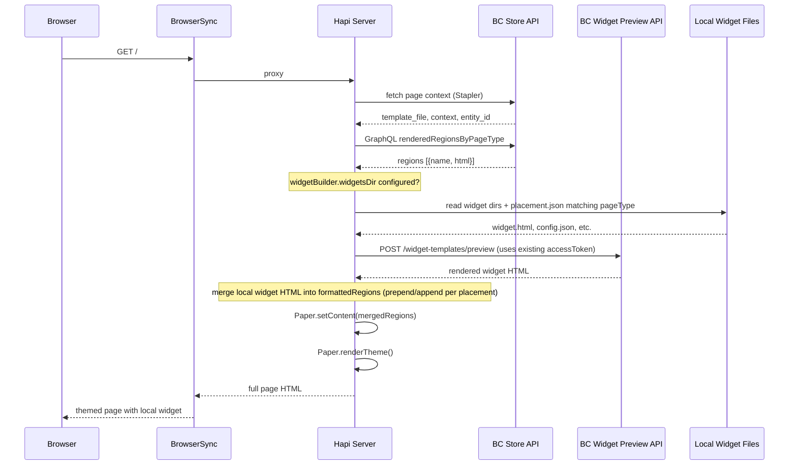

# Widget Builder + Stencil CLI Integration

## How the systems work today

**stencil-cli** renders theme pages by:
1. Fetching page data/context from the live BC store (Stapler/TemplateEngine)
2. Fetching **widget region HTML** via the Storefront GraphQL API (`renderedRegionsByPageType`)
3. Building a `formattedRegions` map (`{ regionName: html }`) and passing it to Paper via `paper.setContent()`
4. Paper's `{{{region name="..."}}}` helper substitutes the HTML into the rendered page

The critical injection point is in [`renderer.module.js`](server/plugins/renderer/renderer.module.js) lines 221-232:

```221:232:server/plugins/renderer/renderer.module.js
    const formattedRegions = {};
    if (typeof regionResponse.renderedRegions !== 'undefined') {
        regionResponse.renderedRegions.forEach((region) => {
            formattedRegions[region.name] = region.html;
        });
    }
    return internals.getPencilResponse(
        response2.data,
        request,
        response2,
        configuration,
        formattedRegions,
    );
```

**widget-builder** renders widgets by:
1. Reading local files (`widget.html`, `config.json`, `query.graphql`, `queryParams.json`)
2. POSTing a `WidgetPreviewRenderRequest` to the BC Widget Preview API (`/content/widget-templates/preview`)
3. Getting back rendered HTML and displaying it in an isolated React app

---

## Approach: Region Injection via config.stencil.json

**Concept:** Add a `widgetBuilder` section to `config.stencil.json` that points to a directory of local widgets. Each widget folder has a `placement.json` specifying which page type and region it belongs to. During page rendering, after fetching store regions via GraphQL, stencil-cli also renders matching local widgets via the BC Widget Preview API and merges their HTML into `formattedRegions`.

### Configuration

Add to `config.stencil.json` (non-secret, can be committed):

```json
{
  "normalStoreUrl": "https://mystore.mybigcommerce.com",
  "port": 3000,
  "widgetBuilder": {
    "widgetsDir": "./widgets"
  }
}
```

The `widgetsDir` path is resolved relative to the theme root (same directory as `config.stencil.json`). When this property is present, stencil-cli enables the local widget rendering pipeline. When absent, behavior is unchanged.

The existing `accessToken` in `secrets.stencil.json` is reused for the Widget Preview API. The token must be created with the `content manage` scope in addition to the usual storefront scopes. No separate widget-builder credentials are needed.

### Widget directory structure

```
my-theme/
  widgets/                     # <-- widgetBuilder.widgetsDir
    test-banner/
      widget.html
      schema.json
      config.json
      query.graphql           # optional
      queryParams.json        # optional
      placement.json          # maps widget to page types + regions
    hero-carousel/
      widget.html
      schema.json
      config.json
      placement.json
```

### placement.json format

Mirrors the BC Placement API concepts. Page type values are **lowercase**. The `position` property is **optional** and defaults to `"prepend"`. If a region name ends with `"--global"`, the `entity_id` property is ignored (global regions are not scoped to a specific entity).

```json
{
  "placements": [
    {
      "page_type": "home",
      "region": "home_below_menu"
    },
    {
      "page_type": "product",
      "region": "product_below_price",
      "position": "append",
      "entity_id": 123
    },
    {
      "page_type": "category",
      "region": "header_bottom--global"
    }
  ]
}
```

Notes on `placement.json`:
- `page_type` -- lowercase string matching template-to-pageType mappings (e.g. `"home"`, `"product"`, `"category"`, `"brand"`, `"page"`, `"blog"`, `"cart"`, `"search"`, etc.)
- `region` -- must match a `{{{region name="..."}}}` declaration in the theme templates
- `position` -- `"prepend"` (default) or `"append"` relative to any existing region HTML from the store
- `entity_id` -- optional; restricts the widget to a specific product/category/page/etc. Ignored when the region name ends with `"--global"`
- A single widget can have multiple placements (e.g. show on both home and product pages)

### Where to modify

- [`lib/stencil-start.js`](lib/stencil-start.js) -- read `widgetBuilder.widgetsDir` from `stencilConfig` (which comes from `StencilConfigManager.read()`), resolve the path relative to `themePath`, pass it through to `Server.create()` as a new option
- [`server/index.js`](server/index.js) -- pass `widgetsDir` and `accessToken` into the Renderer plugin options
- [`server/plugins/renderer/renderer.module.js`](server/plugins/renderer/renderer.module.js) -- after building `formattedRegions` from GraphQL, call the local widget renderer for matching widgets and merge their HTML
- New file: [`lib/local-widget-renderer.js`](lib/local-widget-renderer.js) -- core logic described below
- [`lib/stencil-start.js`](lib/stencil-start.js) `startBrowserSync()` -- add a BrowserSync watcher on the widgets directory for hot reload

### lib/local-widget-renderer.js -- detailed behavior

1. **Scan**: read all subdirectories under `widgetsDir`, each expected to contain `widget.html`, `config.json`, `schema.json`, and `placement.json`
2. **Match**: for the current page render, receive `pageType` (uppercase, from `getPageType()`) and `entityId`. Compare against each widget's `placement.json` entries:
   - Convert the placement's lowercase `page_type` to uppercase for comparison with stencil-cli's internal `PageTypes` constants (e.g. `"home"` -> `"HOME"`)
   - If the region name ends with `"--global"`, ignore the `entity_id` field -- the widget matches any entity on that page type
   - If the region name does NOT end with `"--global"` and the placement has an `entity_id`, only match when `entityId === placement.entity_id`
   - If the placement has no `entity_id` and the region is not global, match all entities of that page type
3. **Render**: for each matched placement, build a `WidgetPreviewRenderRequest` (same shape as widget-builder uses) from the widget's local files, POST to the Preview API using the existing `accessToken`
4. **Merge**: return a map of `{ regionName: { html, position } }` entries. The caller in `renderer.module.js` prepends or appends each widget's HTML to the corresponding entry in `formattedRegions` (defaulting to prepend)
5. **Cache**: cache rendered HTML keyed by widget directory. Invalidate on file change (detected by BrowserSync watcher). On cache hit, skip the Preview API call entirely

**Data flow:**



**Pros:**
- Minimal changes -- works with existing `{{{region}}}` helpers, no stencil-paper patch needed
- Widget appears inside the real theme with full CSS/styles
- `placement.json` is intuitive and mirrors the BC Placement API
- Hot reload via existing BrowserSync file-watch mechanism
- Uses the existing `accessToken` -- just needs `content manage` scope added to the token
- Config-driven (in `config.stencil.json`) -- no flags to remember on every startup

**Cons:**
- Each render adds a Preview API call per widget (adds ~200-500ms latency per widget); mitigated by caching rendered HTML and only re-rendering on widget file changes
- The Preview API renders widget templates in isolation (it does not have access to `theme_settings` Handlebars variables), so any theme_settings references in `widget.html` will not resolve; this is the same limitation as widget-builder today

---

## Installing as a separately named command

To test the modified stencil-cli without affecting the stable `stencil` command:

**Option 1: Dual bin entry + npm link (simplest)**

Add a new bin entry to [`package.json`](package.json):

```json
"bin": {
    "stencil": "./bin/stencil.js",
    "stencil-wb": "./bin/stencil.js",
    ...
}
```

Then from the modified stencil-cli directory:

```bash
npm link
```

This creates both `stencil` and `stencil-wb` as global commands pointing to the same code. But this would shadow the original `stencil` too.

**Option 2: Separate package name via npm link (recommended)**

Keep the original `@bigcommerce/stencil-cli` installed globally (or via npx). For your fork:

1. Change the `name` field in `package.json` to something like `@bigcommerce/stencil-cli-wb`
2. Add a dedicated bin entry: `"stencil-wb": "./bin/stencil.js"`
3. Run `npm link` from the forked repo

Now `stencil start` uses the stable version and `stencil-wb start` uses your modified version. Both can run in the same theme directory.

**Option 3: Shell alias (quickest, no code changes)**

```bash
alias stencil-wb='/path/to/modified/stencil-cli/bin/stencil.js'
```

This is zero-config but doesn't survive new terminals without adding to `.zshrc`.

**Recommended:** Option 2. Rename the package, add a `stencil-wb` bin, and `npm link`. This gives clean separation with zero risk to the stable toolchain.

---

## Credential / auth strategy

The existing `accessToken` in `secrets.stencil.json` is reused for the Widget Preview API. The token must be created with the `content manage` scope (in addition to the usual storefront scopes). No separate widget-builder credentials or additional config fields are needed.

When `widgetBuilder.widgetsDir` is configured and the Preview API returns a 403, stencil-cli should print a clear error message explaining that the token needs the `content manage` scope.

The Preview API call uses the `accessToken` as `X-Auth-Token` and sends the request to `{storeUrl}/content/widget-templates/preview` (the same management API gateway used by widget-builder, but derived from the store's API host rather than a separate env var).

---

## Future enhancement: Handlebars helper (Phase 2)

If placement via named regions proves too limiting (e.g., you want to inject a widget inline in a product template, outside any `{{{region}}}`), a custom Handlebars helper could be added later:

```handlebars
{{widget-builder path="ob-custom/widgets/test-widget"}}
```

This would require either registering a helper on Paper's Handlebars instance in `pencil-response.js` (with a two-pass pre-render approach, since helpers are synchronous) or patching `@bigcommerce/stencil-paper`. This is a more invasive change and not needed for the initial implementation.
